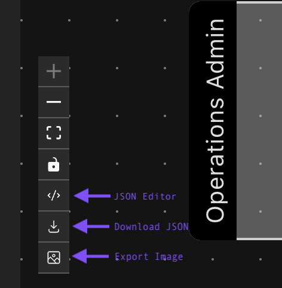

# BPMN Process Extraction & Visualization

An intelligent system that converts natural language feature descriptions into interactive BPMN (Business Process Model and Notation) swimlane diagrams using AI-powered process extraction.

## 💻 Rendered Output


## 💥 Bonus Features


## 🚀 Features

- **Intelligent Process Extraction**: Convert feature descriptions into structured process flows using AI agents
- **Multi-LLM Support**: Compatible with OpenAI, Azure OpenAI, and Anthropic (Claude) providers
- **Interactive Diagrams**: Generate React-Flow compatible swimlane diagrams
- **Real-time Processing**: WebSocket-based streaming for live updates
- **Process Validation**: Built-in Zod schema validation for data integrity
- **Actor-based Swimlanes**: Automatically organize process steps by responsible actors

## 🏗️ Architecture

### Backend Components

- **BaseAgent**: Abstract foundation for all AI agents with chat engine integration
- **ProcessExtractionAgent**: Specialized agent for converting feature descriptions to BPMN diagrams
- **LLM Providers**: Modular provider system supporting multiple AI services
- **Real-time Communication**: Socket.io integration for live updates

### Frontend Features

- Interactive BPMN diagram rendering
- Swimlane visualization with actor grouping
- Process flow validation and error handling
- Real-time status updates during extraction

## 🛠️ Tech Stack

**Backend:**

- Node.js + TypeScript
- Express.js
- Socket.io for real-time communication
- LlamaIndex for AI integration
- Zod for schema validation

**Frontend:**

- React
- React-Flow for diagram rendering
- TypeScript

**AI Integration:**

- OpenAI GPT models
- Azure OpenAI
- Anthropic Claude

## 🚀 Quick Start

### Prerequisites

- Node.js (v22+)
- npm or yarn
- `.env` file

### Installation

1. **Clone the repository:**

```bash
git clone https://github.com/bmaniteja/bpmn.git
cd bpmn
```

1. **Install dependencies:**

```bash
npm i
```

1. **Environment Configuration:**
Copy the shared `.env` file to the backend directory root

1. **Start the development environment:**

```bash
npm run dev # run in the project root
```

This will run both frontend and backend concurrently.

## 📝 Usage

### Basic Process Extraction

1. Connect to the application
1. Send a feature description via the WebSocket interface
1. The system will:
- Analyze the feature description
- Extract actors, steps, and decision points
- Generate a React-Flow compatible diagram
- Return the structured process data

### Example Feature Description

```
"When a customer submits a purchase order, the operator reviews it.
If the order requires escalation, the operations admin handles it.
The admin then approves or rejects the order. If rejected, the
operator must edit and resubmit."
```

### Generated Output


The system produces:

- **Actors**: Identified roles (Customer, Operator, Operations Admin)
- **Process Steps**: Start, action, decision, and end nodes
- **Flow Connections**: Edges showing process flow
- **Swimlanes**: Actor-grouped visualization
- **Metadata**: Process complexity, step count, timestamps

## 🎨 Diagram Types

### Node Types

- **Start**: Process initiation points (Green)
- **Action**: Tasks and activities (Blue)
- **Decision**: Choice points with conditions (Gold)
- **End**: Process completion (Salmon)

### Swimlane Organization


- Each actor gets a dedicated swimlane with unique colors
- Nodes are positioned within their respective actor lanes
- Flow connections show process dependencies

## 🔧 Configuration

### LLM Provider Selection

Change the `MODEL_PROVIDER` in your environment:

```typescript
// Supported providers
enum LLMProviderName {
AZURE_OPENAI = "azure-openai",
ANTHROPIC = "anthropic",
OPENAI = "openai",
}
```

### Agent Configuration

Customize the ProcessExtractionAgent:

```typescript
const config = {
provider: LLMProviderName.OPENAI,
streaming: true,
contextPersistence: true,
maxTokens: 3000,
temperature: 0.2, // Low temperature for consistent JSON
};
```

## 📊 Data Schema

The system uses Zod schemas for validation:

```typescript
// Process diagram structure
interface ProcessDiagramData {
nodes: ReactFlowNode[];
edges: ReactFlowEdge[];
metadata: {
processName: string;
totalSteps: number;
complexity: 'low' | 'medium' | 'high';
createdAt: string;
};
}
```


## Libraries Used

- [LlamaIndex](https://github.com/run-llama/LlamaIndex) for AI integration framework
- [React-Flow](https://reactflow.dev/) for diagram rendering
- [bpmn.io](https://bpmn.io/) BPMN for inspiration
- [Socket.io](https://socket.io/) for real-time communication
